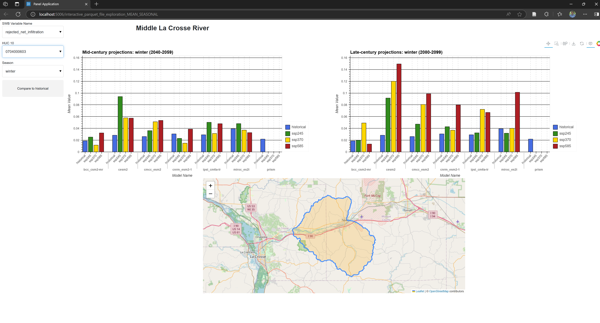
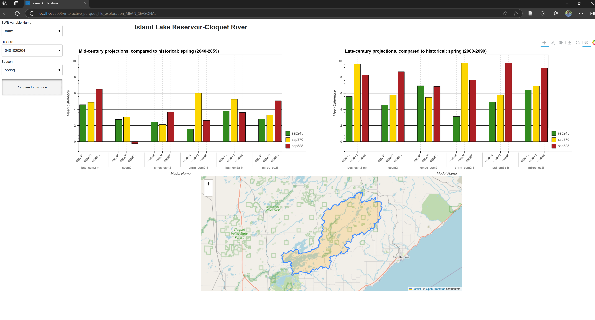

# mn_seasonal_dashboard
Proof-of-concept Holoviews and panel dashboard for exploring seasonal CMIP6-driven SWB model output.

Create a Python environment before running the script:
```shell
mamba env create -f environment.yml
```

Activate the environment you created, then start up the dashboard:
```shell
panel serve python/interactive_parquet_file_exploration_MEAN_SEASONAL.py --show
```

A dashboard should be created that will allow for exploration of the zonal statistics contained in the parquet file.



The 'Compare to historical' button may be selected, which will display the difference between the model output for the given scenario and timeframe and the 'historical' conditions for 1995-2014.




The zonal statistics represent the mean sum/mean of various SWB model outputs for a predefined set of HUC10 units.